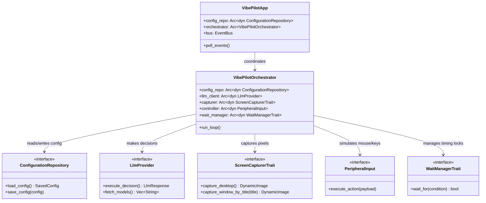
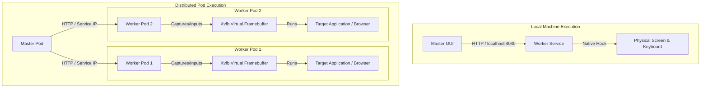
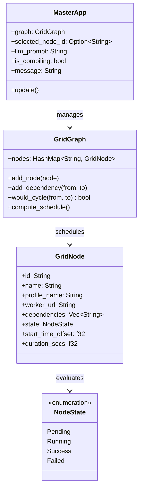
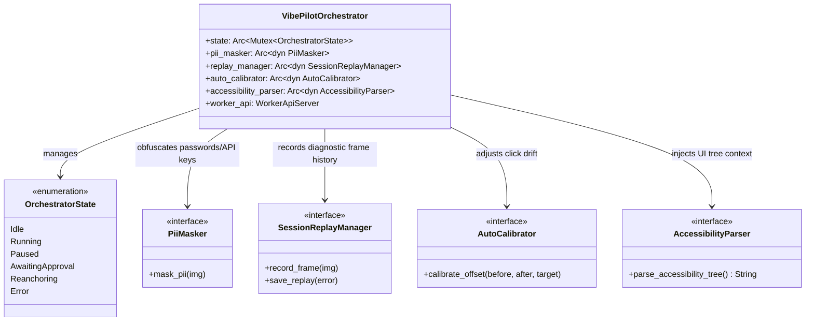
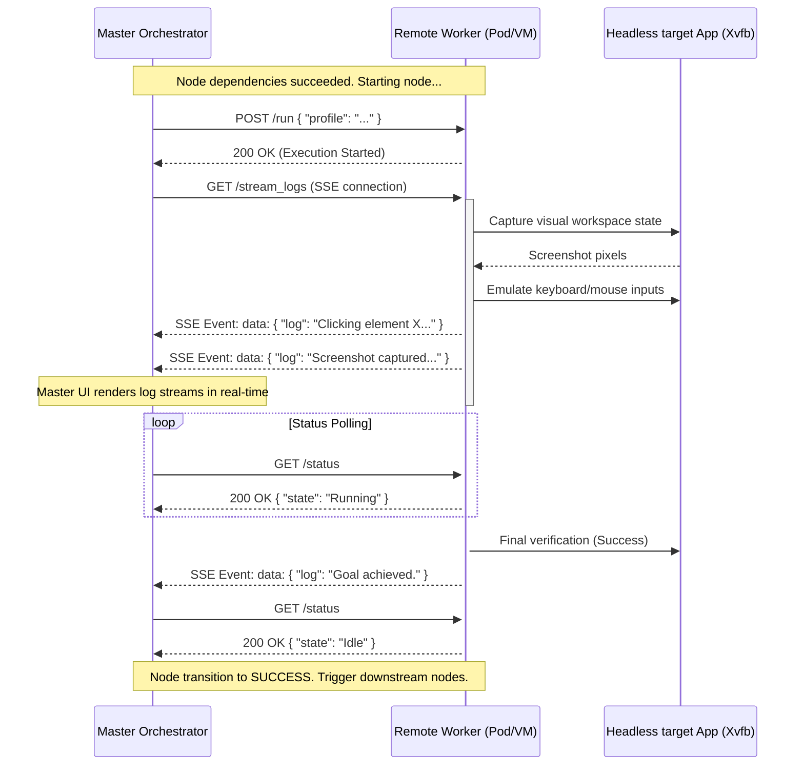

# VibePilot System Architecture & Class Design

This document details the decoupled, factory-based Inversion of Control (IoC) architecture of VibePilot, detailing the **Worker Agent**, the **Master Grid Orchestrator**, and their distributed deployment models.

---

## 1. Core Worker Service Abstraction (IoC & Factories)

VibePilot decouples high-level application logic from low-level systems (screen capture, input emulation, HTTP APIs, and local state management) by routing all dependencies through abstract traits.

### Service Dependency UML Diagram



### Instantiation Factories

To avoid concrete compilation coupling, all services are resolved via factories at startup inside [app.rs](file:///e:/Dev/Projets/Agent_AI/vibe_pilot_rust/src/app.rs):

```mermaid
graph TD
    App[VibePilot App / Services] -->|Calls| CRF[ConfigRepositoryFactory]
    App -->|Calls| SCF[ScreenCapturerFactory]
    App -->|Calls| PCF[PeripheralControllerFactory]
    App -->|Calls| LCF[LlmClientFactory]
    App -->|Calls| WMF[WaitManagerFactory]

    CRF -->|Builds| CR[ConfigRepository]
    SCF -->|Builds| SC[ScreenCapturer (GDI / Mock)]
    PCF -->|Builds| PC[PeripheralController (Win32 / rdev)]
    LCF -->|Builds| LC[LlmClient (reqwest)]
    WMF -->|Builds| WM[WaitManager]
```

---

## 2. Deployment Topology: Local vs. Headless Containerized Pods

VibePilot is architected to operate transparently either on a single user machine or scaled across a distributed cluster (such as Docker containers or Kubernetes pods).



### Local Single-Machine Mode (Default)
- **Execution**: The Master GUI process runs alongside a local Worker process on the user's workstation.
- **Hardware Binding**: The Worker binds to `127.0.0.1:4040` and interacts directly with the physical workstation monitor using native OS APIs (e.g. GDI capture on Windows) and injects input events into the host input stream.
- **Utility**: Ideal for interactive debugging, manual scheduling, and direct personal productivity automation.

### Distributed Containerized Mode (Docker / Kubernetes)
- **Execution**: Worker instances are packaged into lightweight Docker images running Linux or Windows.
- **Virtualizing the Screen (Headless Automation)**: Because container pods run headless, a virtual screen is configured:
  - **Linux Containers**: Launch an **X Virtual Framebuffer (Xvfb)** server (e.g. on virtual display `:99`) along with a virtual window manager and input drivers. Target applications (VS Code, Chrome, etc.) run inside this virtual display context.
  - **Windows Containers**: Run under isolated Session-0 virtual desktops or using a virtual screen display driver.
- **Visual Capture & Input**: The Worker captures screenshot bytes from Xvfb's virtual memory socket (`/tmp/.X11-unix/X99`) and injects mouse/keyboard input events using tool wrappers (like `xdotool` or direct X11 input APIs).
- **Network Orchestration**: The Master GUI (running on the developer's machine or in a management container) schedules tasks by calling the Workers' HTTP APIs (`POST /run`, `GET /status`, `GET /stream_logs`) targeting their pod IP addresses or container ports.
- **Coexistence**: Local execution is never removed; the Master treats local and remote workers identically since all interactions are routed over standard HTTP.

---

## 3. VibePilot Grid Master Architecture

The `vibepilot_master` binary coordinates a Directed Acyclic Graph (DAG) of VibePilot workers representing Gantt project execution steps.

### Master Class Layout



- **Dependency Loop Guard**: The `would_cycle` method checks dependencies recursively before creating link arrows to ensure the graph forms a Directed Acyclic Graph (DAG).
- **Timeline Scheduler**: The `compute_schedule` method recursively traverses dependencies to evaluate the earliest start offset for each node based on the duration of its parents:
  $$\text{StartOffset}_{\text{node}} = \max_{p \in \text{Parents}} (\text{StartOffset}_p + \text{Duration}_p)$$

---

## 4. Advanced Worker Agent Abstractions

To increase robustness, safety, and remote monitoring capabilities, the worker agent exposes a set of modular traits and an explicit State Machine (FSM).

### Advanced Abstractions UML Diagram



---

## 5. Under the Hood: Detailed Feature Mechanics

Here is the exact technical operation of each advanced subsystem in VibePilot:

### 1. SSE Log Streaming
- **Mechanics**: Implements a server-sent events (SSE) server inside `src/services/api.rs`.
- **Flow**: When a client connects to `GET /stream_logs`, the server responds with headers `Content-Type: text/event-stream` and `Connection: keep-alive`. It registers a subscriber on the worker's internal `EventBus`. Whenever the worker emits a `NotificationEvent::Log(msg)`, the subscriber receives it, formats it as `data: <msg>\n\n`, and writes it to the socket in real-time.

### 2. Parallel DAG Execution Engine
- **Mechanics**: Implemented in `src/master/executor.rs` via `GridGraphExecutor`.
- **Scheduling**: Runs a background polling loop checking for `Pending` nodes. If a pending node's parent dependencies are all marked `Success`, it spawns an async task to execute the node:
  1. Sets node status to `Running`.
  2. Subscribes to the worker's SSE `/stream_logs` endpoint to pipe logs live to the Master UI.
  3. Sends a `POST /run` request to the target worker.
  4. Polls `GET /status` until the worker returns to `Idle`.
  5. Evaluates success or failure. If a node fails, it recursively marks downstream dependencies as `Failed`/`Blocked`.

### 3. Local Vision-LLM Fallback (Ollama)
- **Mechanics**: Built as a retry wrapper in `src/orchestrator/run_loop_helpers.rs`.
- **Flow**: When a cloud LLM query fails (due to network drops, timeouts, or API rate limits), the orchestrator catches the error. If fallback is enabled, it reroutes the identical prompt and base64 screenshot payload to a local Ollama endpoint (`http://127.0.0.1:11434/v1/chat/completions`) using the `llava` vision model. This guarantees offline redundancy.

### 4. Hardware-Bound DPAPI Security
- **Mechanics**: Implemented in `src/secure_store.rs` and `src/config/helpers.rs`.
- **Flow**: The secure store saves config data in `vibepilot_data.enc` encrypted with AES-256-GCM. The key is retrieved from `key.enc`. On Windows, if `chiffrement_dpapi` is enabled, the store encrypts the file (or symmetric key) using the Windows Data Protection API (`CryptProtectData`), binding the ciphertext directly to the local Windows User account. On non-Windows platforms, it falls back to standard AES key protection.

### 5. Auto-Calibration
- **Mechanics**: Resolves mouse offset drift programmatically.
- **Flow**: The calibrator captures a screenshot $I_{\text{before}}$, performs the mouse click, waits 100ms, and captures $I_{\text{after}}$. By computing a visual difference $|I_{\text{after}} - I_{\text{before}}|$, it locates the center of gravity of changed pixels (e.g. active buttons or text selections). It computes the delta between the requested click coordinate and the actual visual change and updates the runtime calibration offset table.

### 6. PII Masking
- **Mechanics**: Protects sensitive information before cloud upload.
- **Flow**: Captured screenshots are passed through a local Tesseract OCR engine. The resulting text blocks are scanned using Regular Expressions for sensitive patterns (API keys, passwords, credit card numbers). For each match, the masker draws a solid black rectangle over the matching coordinate box directly on the raw image buffer.

### 7. Session Replay Buffer
- **Mechanics**: Provides flight recorder diagnostic replay capabilities.
- **Flow**: The `SessionReplayManager` keeps a circular memory queue containing the last 10 screenshots. Upon execution failure, timeout, or user cancellation, it dumps these 10 frames sequentially to a timestamped diagnostic directory, allowing developers to replay the precise sequence of events leading up to the failure.

### 8. Accessibility Tree Parser
- **Mechanics**: Under Windows, queries the UI Automation (UIA) tree API.
- **Flow**: Recursively crawls control nodes of the active window, extracting control types, coordinates, titles, and IDs. This hierarchical tree is formatted as a structured text block and injected into the LLM prompt, providing structural metadata to supplement raw pixel vision.

---

## 6. Operational Workflow & Distributed Lifecycle

This section explains the practical lifecycle of VibePilot Grid: how projects are configured, how remote workers are managed, and how execution is tracked across the network.

### 1. Project Configuration & Profiles
1. **Definition**: A project is a Directed Acyclic Graph (DAG) representing a sequence of tasks.
2. **Templating**: The user can generate a graph by describing the project to the LLM or load a predefined template.
3. **Customization**: Each node in the graph (`GridNode`) contains:
   - The target worker endpoint (`worker_url`, e.g. `http://192.168.1.100:4040`).
   - The LLM model configuration, prompts, and settings specific to that task.
4. **Persistence**: The Master GUI saves this graph configuration into a JSON project profile (e.g. `save.enc` or exported profiles). This allows reloading the project state and customizing details before running.

### 2. Worker Node Provisioning
- **Self-Hosted Infrastructure**: VibePilot does *not* dynamically provision or install remote VMs/containers. Workers are pre-deployed services.
- **Deployment**:
  - **Bare Metal / VM**: The static `vibepilot` binary is launched on target machines (e.g., `vibepilot.exe --port 4040`).
  - **Docker / Kubernetes**: A container image wrapping `vibepilot` (and virtual framebuffers like `Xvfb`) is deployed as a replica set or pods, exposing their HTTP APIs.
- **Addressing**: The Master GUI maps tasks to nodes by specifying the worker's URL (IP and port) in the node's properties.

### 3. Remote Execution Tracking (Sequence Flow)

When a node's dependencies are resolved, the Master GUI executor initiates remote execution and streams updates:


